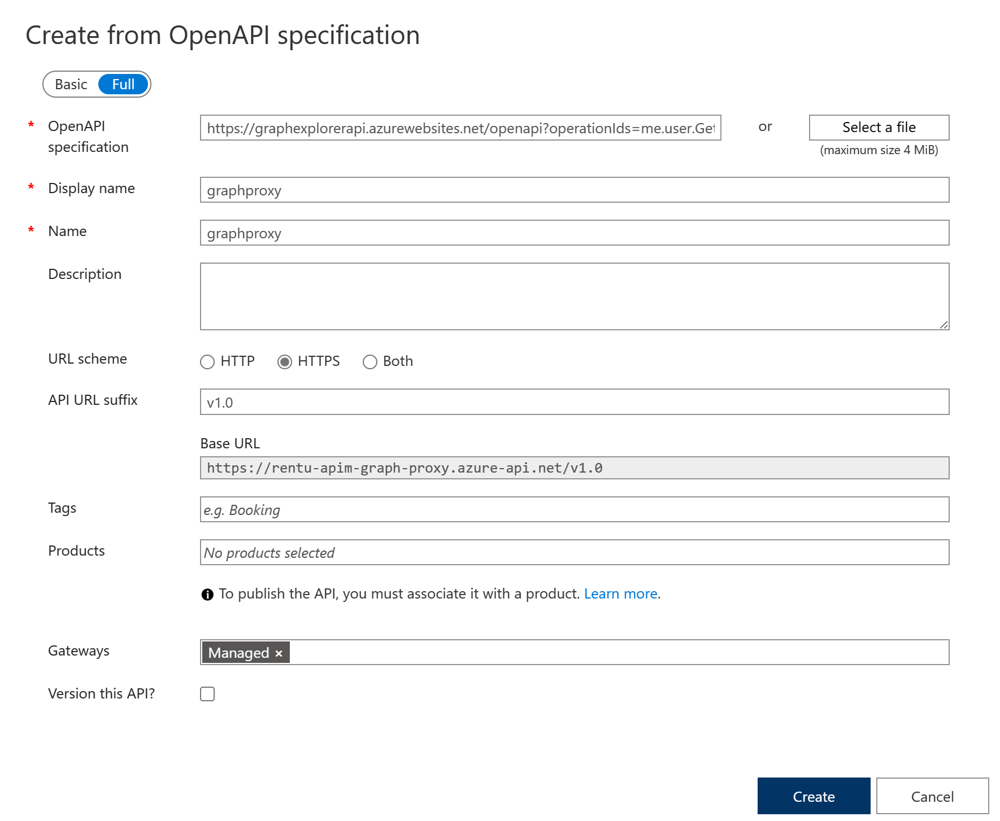
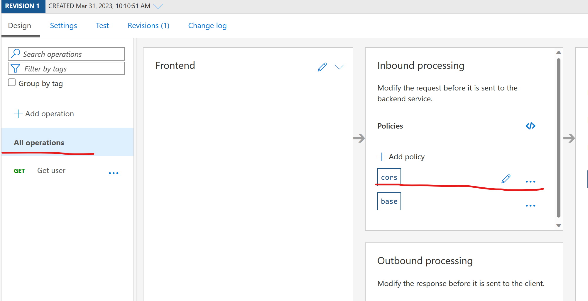
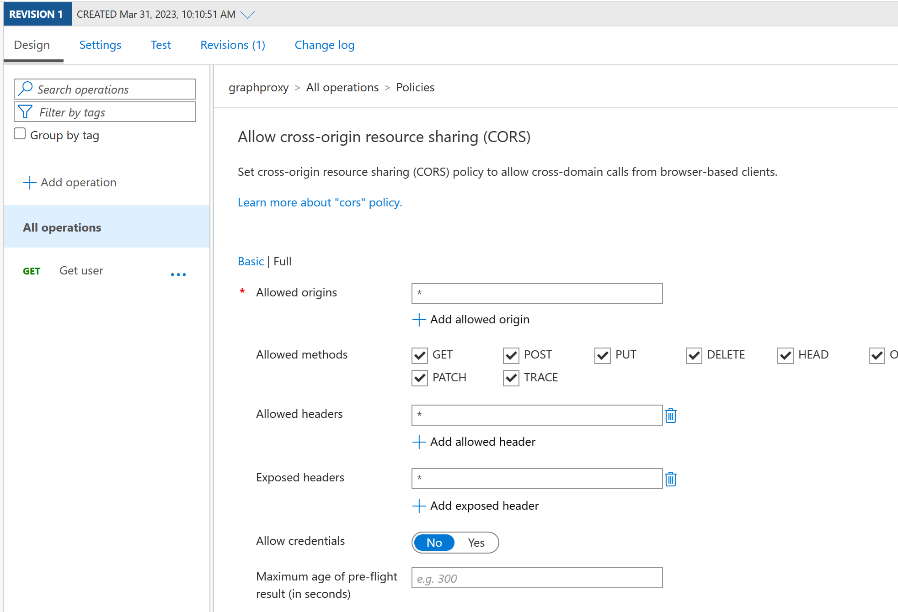
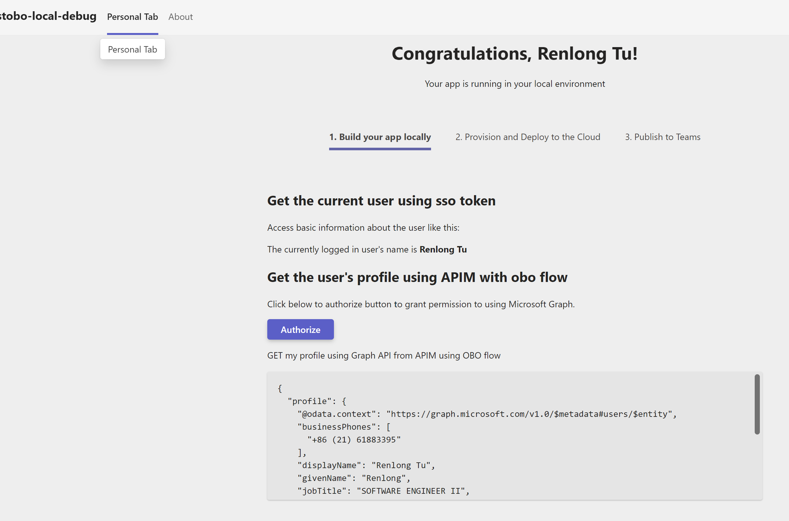

# Introduction
This sample project demonstrate use APIM as proxy to call Graph API with OBO flow

# Prerequisite
- [Node.js](https://nodejs.org/en/), supported versions: 14, 16, 18
- A Microsoft 365 account. If you do not have Microsoft 365 account, apply one from [Microsoft 365 developer program](https://developer.microsoft.com/en-us/microsoft-365/dev-program)
- Latest stable [Teams Toolkit Visual Studio Code Extension 4.x.x](https://aka.ms/teams-toolkit)

# Quick Start
- Clone this teams app, open in VSCode, and click F5 to preview this Teams App, after preview success, close debug session of VSCode. It will create and config necessary AAD app and teams app.  

- Import Graph API spec to your APIM instance as below: https://graphexplorerapi.azurewebsites.net/openapi?operationIds=me.user.GetUser&openApiVersion=2&graphVersion=v1.0&format=yaml&style=Plain&singularizeOperationIds=False

  


- Update cors configuration for all apis:
  ```xml
  <policies>
    <inbound>
        <cors>
            <allowed-origins>
                <origin>*</origin>
            </allowed-origins>
            <allowed-methods>
                <method>*</method>
            </allowed-methods>
            <allowed-headers>
                <header>*</header>
            </allowed-headers>
            <expose-headers>
                <header>*</header>
            </expose-headers>
        </cors>
        <base />
    </inbound>
    <backend>
        <base />
    </backend>
    <outbound>
        <base />
    </outbound>
    <on-error>
        <base />
    </on-error>
  </policies>
  ```
  

  

- Add named values, and these values can be found in `.fx/states/state.local.json`
  * clientId
  * clientSecret
  * scope
  * tenantId

- Click the imported API, and update the inbound policy as below for exchanging obo token:
  ```xml
  <policies>
      <inbound>
          <base />
          <send-request ignore-error="true" timeout="20" response-variable-name="bearerToken" mode="new">
              <set-url>https://login.microsoftonline.com/{{tenantId}}/oauth2/v2.0/token</set-url>
              <set-method>POST</set-method>
              <set-header name="Content-Type" exists-action="override">
                  <value>application/x-www-form-urlencoded</value>
              </set-header>
              <set-body>@{
                var assertion = context.Request.Headers.GetValueOrDefault("Authorization","").Replace("Bearer ","");
                return $"client_id={{clientId}}&scope={{scope}}&client_secret={{clientSecret}}&assertion={assertion}&requested_token_use=on_behalf_of&grant_type=urn:ietf:params:oauth:grant-type:jwt-bearer";
            }</set-body>
          </send-request>
          <set-header name="Authorization" exists-action="override">
              <value>@("Bearer " + (String)((IResponse)context.Variables["bearerToken"]).Body.As<JObject>()["access_token"])</value>
          </set-header>
          <!--  Don't expose APIM subscription key to the backend. -->
          <set-header name="Ocp-Apim-Subscription-Key" exists-action="delete" />
      </inbound>
      <backend>
          <base />
      </backend>
      <outbound>
          <base />
      </outbound>
      <on-error>
          <base />
      </on-error>
  </policies>
  ```
- Set environment variable in tabs/.env.teamsfx.local as below:
    ```
    REACT_APP_APIM_URL=https://{YOUR_APIM_NAME}.azure-api.net/v1.0
    ```

- In VSCode, click F5 to launch the Teams App, and in the Teams App, click `Authorize` button, then refresh the Teams App page. You can see the below result if everything works fine.

   


# Known Issue
- The sample code uses rest api to call Graph, and Graph SDK authProvider is not work when baseUrl is changed, not sure what's wrong with it, below is the sample code:

    ```ts
    async function callGraphApiUsingSDK(ssoToken: string) {
        const apimBaseUrl = process.env.REACT_APP_APIM_URL;
        const client = Client.init({
            baseUrl: apimBaseUrl,
            authProvider: (done: AuthProviderCallback) => {
                done(null, ssoToken);
            }
        })
        const profile = await client.api("/me").get();
        console.log(profile);
    }
    ```